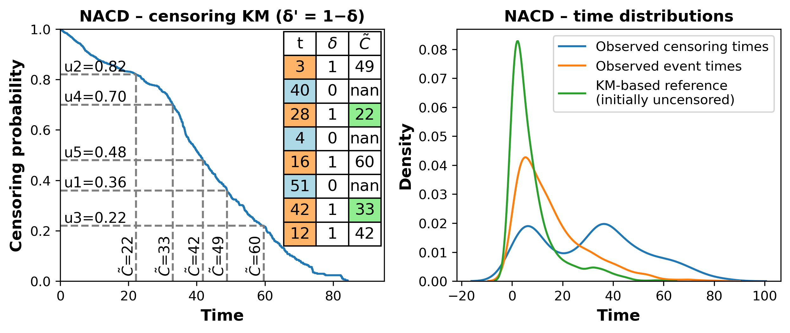
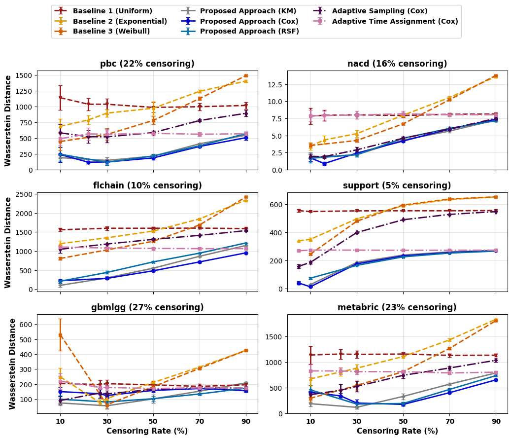
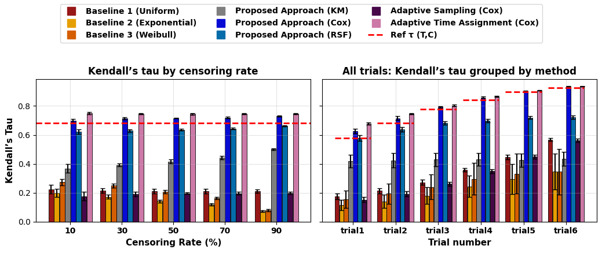

# Take Control of Censoring, Generate Real-World Like Synthetic Data

Implementation for the paper **"Take Control of Censoring, Generate Real-World Like Synthetic Data"**.

This repository contains code for generating semi-synthetic censored survival datasets from real survival data. The paper is available as [paper.pdf](paper.pdf).

## Overview

Survival datasets often contain right-censored observations, and the censoring rate can vary widely across datasets and application domains. This makes it hard to run controlled benchmark studies: a model or metric may appear better simply because the observed censoring pattern changed.

This project modifies an existing survival dataset while keeping covariates and original event times fixed. Starting from subjects with observed events, it selects a subset to relabel as censored and assigns synthetic censoring times before their original event time. The goal is to create derived datasets with controlled censoring rates while preserving realistic censoring-time structure.

The current codebase includes:

- a semi-synthetic censoring pipeline for real datasets,
- a synthetic generator with observable event times `T` and censoring times `C`,
- prepared example inputs for `pbc` and `metabric`.

## Paper Idea

The method has two main steps:

1. Estimate the censoring distribution by treating censoring as the event in a reversed survival problem.
2. Generate a target censoring rate by selecting initially uncensored subjects with censoring-risk-aware weights, then assigning subject-specific censoring times by inverse-CDF sampling.

The paper evaluates generated censoring against a Kaplan-Meier-based reference distribution and studies whether event-censoring dependence is preserved in synthetic settings where both `T` and `C` are observable.



## Key Results

Across the paper experiments, the proposed approach more closely matches the reference censoring distribution than random or parametric rate-matching baselines.



On controlled synthetic data, the method better preserves event-censoring dependence, measured with copula-based Kendall's tau.



## Repository Structure

```text
.
|-- main.py                         # End-to-end runner for prepared datasets
|-- simulate_censoring_pipeline.py  # Core semi-synthetic censoring pipeline
|-- synthetic_generation.py         # Synthetic data generator with observable T and C
|-- data/                           # Prepared input datasets
|-- figures/                        # README figures copied from the paper
|-- results/                        # Generated censored datasets, created at runtime
|-- pyproject.toml                  # uv/Python project metadata
`-- requirements.txt                # Minimal legacy dependency list
```

## Installation

The project supports `uv`:

```bash
uv sync
```

If you prefer `pip`, install the dependencies listed in `pyproject.toml` in a Python 3.10+ environment.

## Input Data

Input datasets are expected to be CSV files with at least:

| Column | Type | Meaning |
| --- | --- | --- |
| `time` | numeric | Observed event or censoring time |
| `event` | integer | Event indicator, where `1` means observed event and `0` means censored |
| other numeric columns | numeric | Covariates used by the censoring model |

The current runner loads:

```text
data/pbc_finale.csv
data/metabric_finale.csv
```

## Running the Pipeline

Run the default pipeline:

```bash
uv run python main.py
```

This will:

- load the prepared datasets from `data/`,
- generate censored versions at target rates `10%`, `30%`, `50%`, `70%`, and `90%`,
- save real-data outputs under `results/{dataset}/`,
- generate six synthetic datasets under `data/synthetic/`.

The target censoring rates and datasets can be edited in [main.py](main.py).

## Outputs

Generated real-data files are saved as:

```text
results/{dataset}/{dataset}_{censoring_rate}_repl_{replication}.csv
```

For example:

```text
results/metabric/metabric_50_repl_1.csv
```

Each generated real-data file contains:

- `time`: observed time after synthetic censoring,
- `event`: updated event indicator,
- `true_time`: original event time before synthetic censoring,
- covariates copied from the input dataset.

Synthetic dependency-study files are saved under:

```text
data/synthetic/
```

These include full simulated vectors for event times, censoring times, observed times, and event indicators.

## Implementation Notes

The paper describes a broader experimental suite with multiple censoring estimators, baselines, ablations, and six public datasets. This repository currently provides the core runnable pipeline and example datasets; extend `main.py` and the pipeline modules to add additional datasets or experimental variants.

The generated `true_time` column should be used only for controlled evaluation or oracle diagnostics, not as a model-training feature.

## Citation

Citation information will be added once final publication metadata are available.
